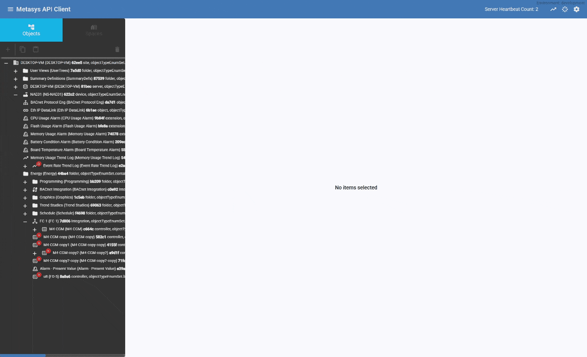
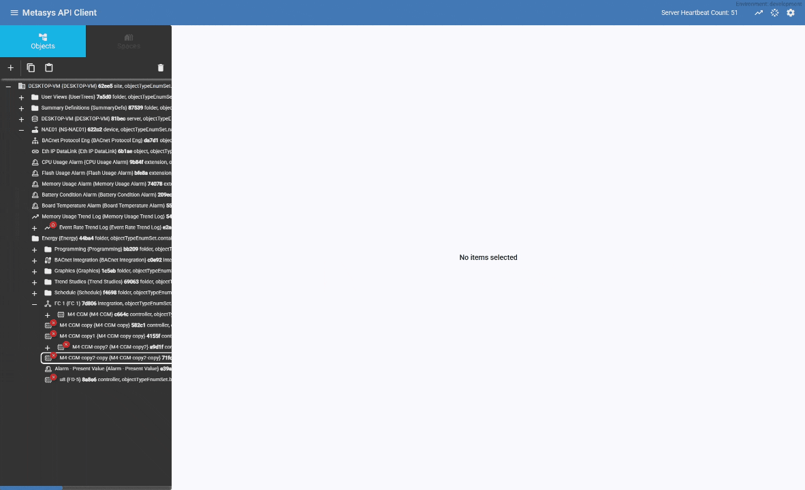
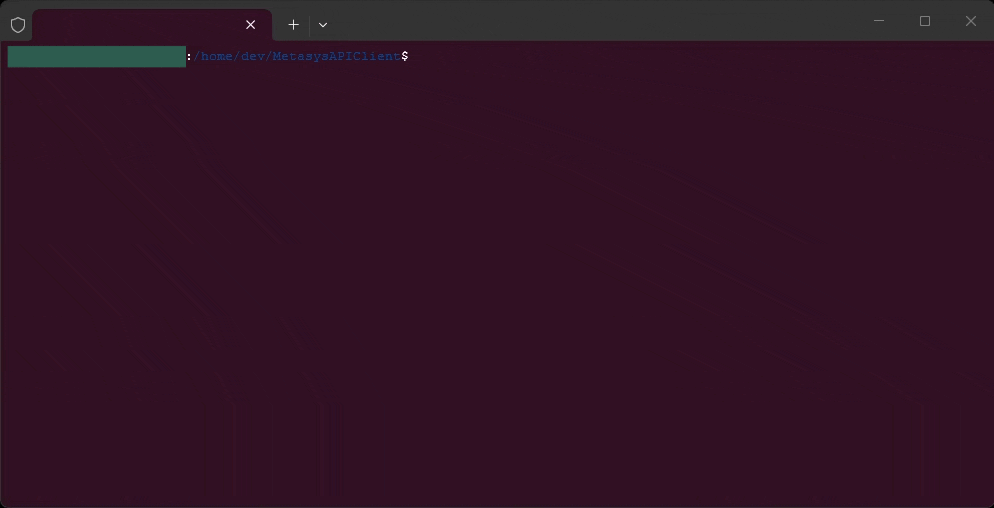
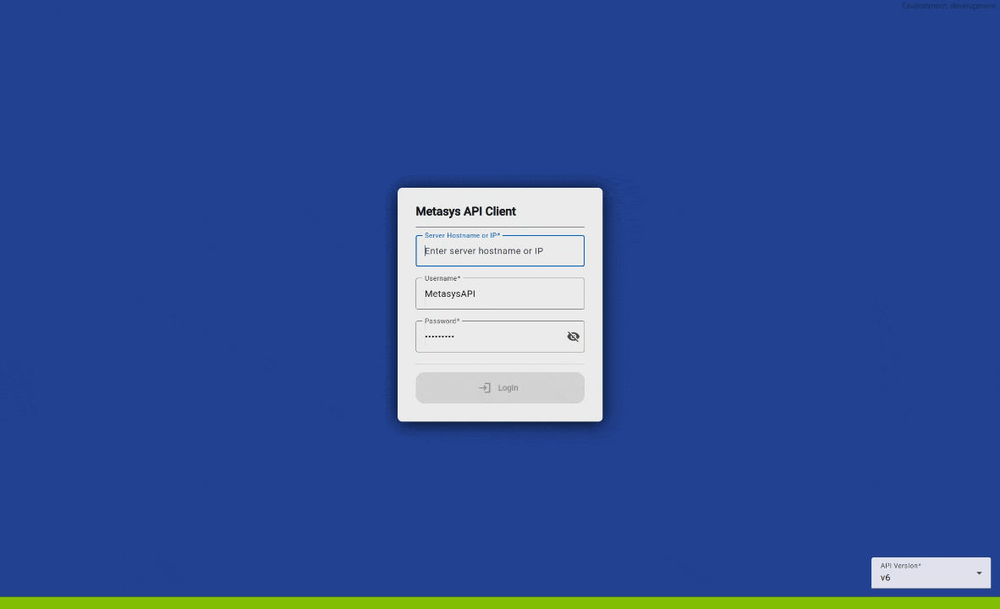

# MetasysAPIClient

<a></a> <a href="https://v21.angular.dev/overview"></a> <a></a> <a href="https://rxjs.dev"></a> <a href="https://www.npmjs.com/"></a> <a href="https://sass-lang.com/documentation"></a>

## Table of Contents

- [About](#about)
- [Requirements](#requirements)
- [Installation](#installation)
- [Development Commands](#development-commands)
- [Roadmap](#roadmap)
- [Mock API](#mock-api)
- [Browsing and modifying objects](#browsing-and-modifying-objects)
- [Core improvements](#core-improvements)
- [New features](#new-features)
- [Deployment options](#deployment-options)

## About

Metasys API Client is an Angular web application for browsing and modifying Metasys objects through the Metasys REST API v6.

The app is currently focused on:

- Network tree navigation
- Object copy and paste workflows
- Object attribute viewing and modification

> [!CAUTION]
> This project is an active work in progress. Test changes carefully, especially operations that modify live objects.

This project was built using [Metasys REST API V6](https://jci-metasys.github.io/api-landing/api/v6) documentation and has not been validated against other API versions.

### Browsing and modifying objects

The object tree supports browsing, selecting, and editing objects from a live Metasys server.

<p align="center">
  <picture align="center">
    <source srcset="images/copyObject.gif" width=80%/>
    
  </picture>
</p>

<p align="center">
  <picture align="center">
    <source srcset="images/configureAndPasteObject.gif" width=80%/>
    
  </picture>
</p>

> [!WARNING]
> Copy and paste for single objects is working, but copy and paste for nested object structures is still in progress.

## Requirements

- Metasys server 14.0
- Metasys Monitoring and Commanding API License
- User account with Access Type set to "API"

## Installation

> [!NOTE]
> This application is currently configured for self-hosted use only (either on the Metasys server or on a machine that can reach the Metasys server).

1. Clone this repository.
2. Install dependencies:

```bash
npm install
```

3. Start the development server:

```bash
npm run start:dev
```
<p align="center">
  <picture align="center">
    <source srcset="images/startingNPMProject.gif" width=80%/>
    
  </picture>
</p>

4. Open `http://localhost:4200`.
5. Sign in with:
   - Metasys host/IP
   - Username
   - Password
   - API version (shown in the app)
<p align="center">
  <picture align="center">
    <source srcset="images/login.gif" width=80%/>
    
  </picture>
</p>

## Development Commands

```bash
npm run start:dev       # Angular dev server at http://localhost:4200
npm run start:mock-api  # Starts the Angular dev server configured for "mock-api" (still need to start mock-api in "./mock-api") http://localhost:3018
npm run build           # Production build
npm test                # Unit tests (Karma + Jasmine)
```

## Roadmap

### Core improvements

- Implement a navigation tree for spaces view
- Expand support for complex object modification, including interlocks, schedules, calendars, and trend studies

### New features

- Trend viewer for trend and trend study objects
- Global object search and modify page

### Deployment options

- Add installation guidance for IIS on Metasys server or technician machine
- Build and distribute the application as an Electron desktop app

## Mock API

> [!WARNING]
> The mock API is an unfinished development feature and is not the primary feature of this application.

Use the mock API only for local development and UI integration workflows. It currently implements an app-focused subset of routes and does not represent complete Metasys API coverage.

Quick start:

```bash
npm run proxy:mock
npm run mock-api:build
npm run mock-api:seed
```

Full mock API setup, route coverage, sync-on-read behavior, and troubleshooting are documented in [mock-api/README.md](mock-api/README.md).
